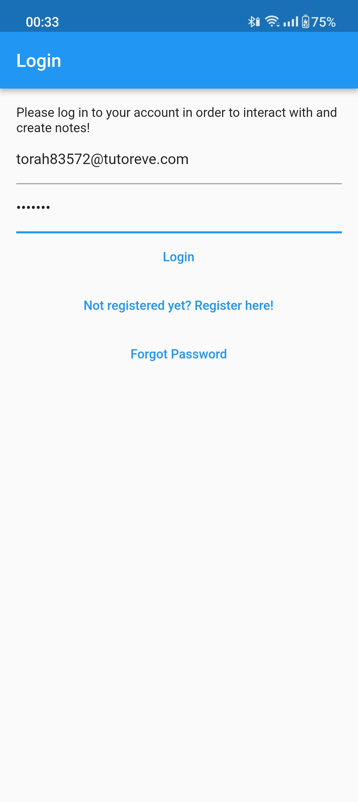
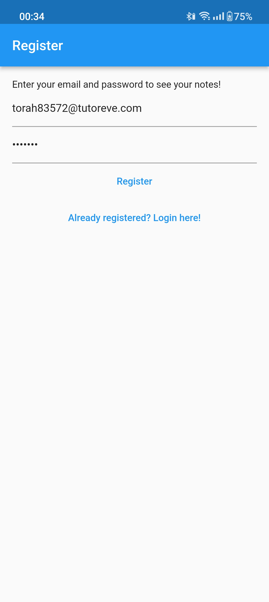
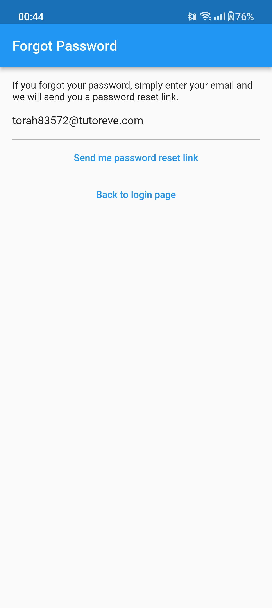
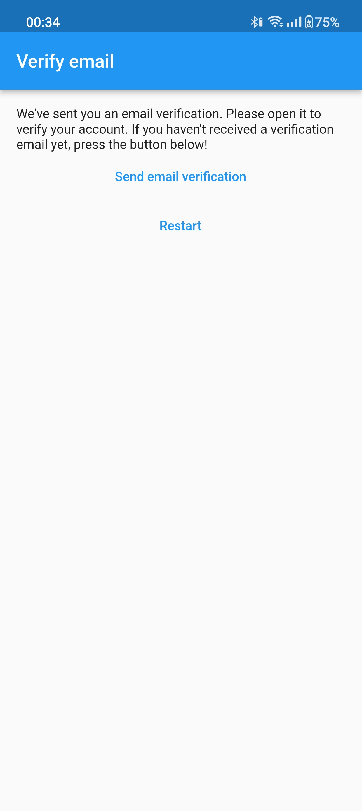
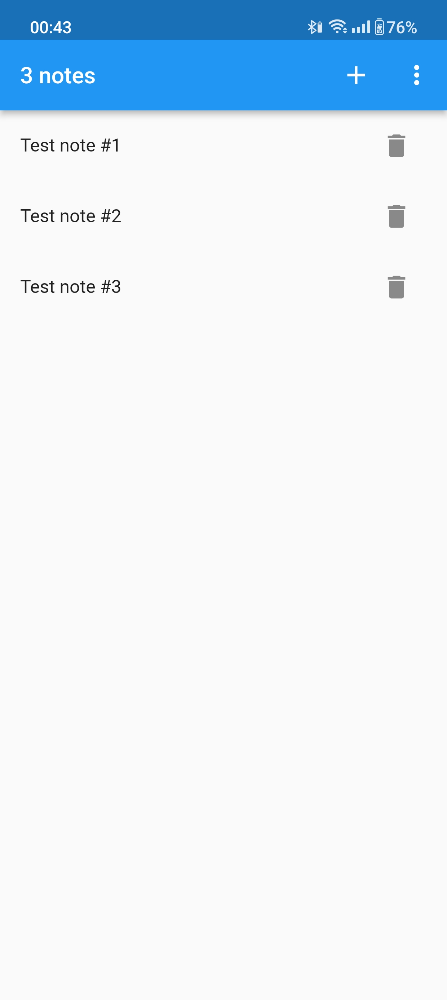
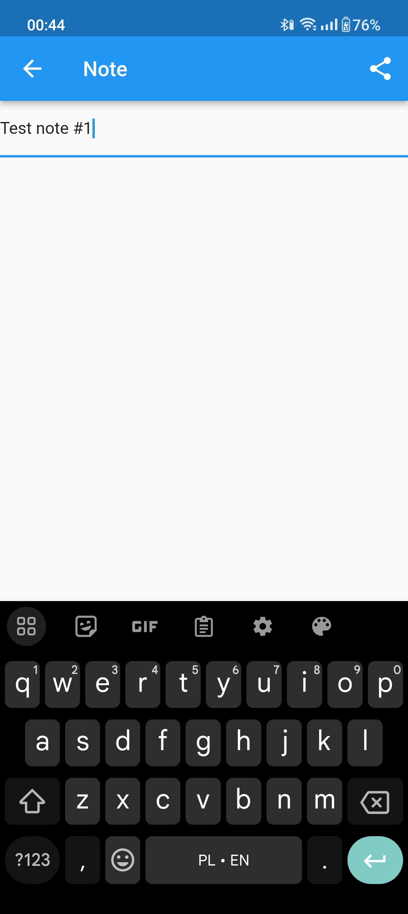

# MyNotes App
MyNotes is a notes app built using Dart, Flutter and Firebase, utilizing the BLoC state management pattern. This app allows users to create, edit, and delete notes, which are stored securely in Firebase.

## Features
- Create, edit, and delete notes
- Firebase authentication for user login and registration
- Real-time synchronization of notes across devices
- BLoC (Business Logic Component) state management for efficient data handling
- Exception handling for possible authentication errors
- Localization for both English and Polish languages

## Views

The MyNotes app encompasses several key views that cater to various functionalities:

### 1. **Login View**

- Allows existing users to authenticate by entering their registered email and password.
- Includes a button that allows users to navigate to the **Register View** in order to create a new account.
- Provides an option for users to reset their password if needed (Forgot Password).

### 2. **Register View**

- Enables new users to create an account by providing necessary registration details (email and password).

### 3. **Forgot Password View**

- Allows users to request a password reset link by entering their registered email.
- Sends an email with instructions for resetting the password.

### 4. **Verify Email View**

- Prompts users to verify their email address after successful registration.
- Instructs users to check their email for a verification link.

### 5. **Notes List View**

- Displays a list of all the user's notes in a scrollable view.
- Allows users to select a note to view its details or initiate editing.
- Provides option to log out current user.

### 6. **Create/Update Note View**

- Enables users to create new and update existing notes by entering a content.
- Provides a Share button to share a note with others.

